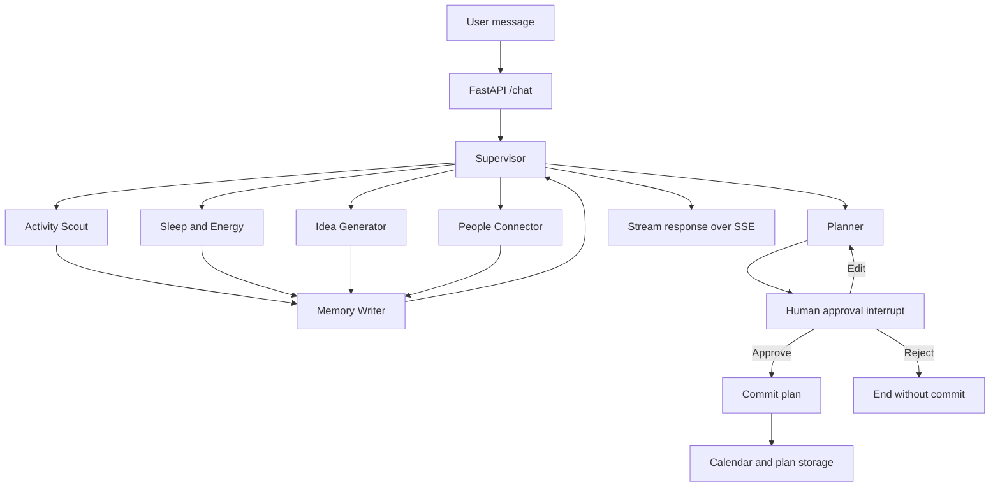
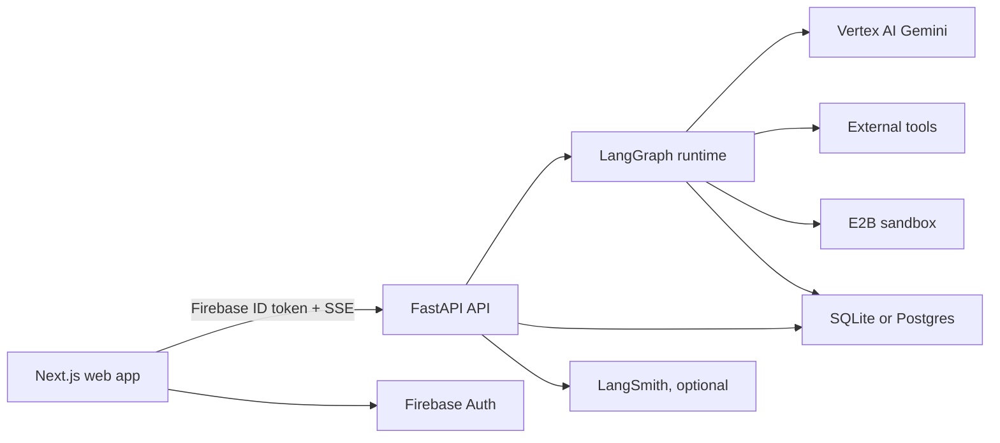

# VITAL

**An agentic life copilot that turns sleep, energy, interests, and intent into grounded actions and plans.**

[Open the web app](https://vital-agent.vercel.app)

VITAL is a full-stack, AI-native application built around a supervised team of specialized agents. Instead of sending every request through one oversized prompt, VITAL uses LangGraph to route work to the right specialist, preserve conversational state, pause for human approval, and safely commit approved plans.

The product combines:

- A multi-agent graph powered by LangGraph and LangChain
- Gemini models through Google Vertex AI
- A FastAPI backend with Server-Sent Events (SSE)
- A Next.js and React web experience
- Firebase Authentication with backend token verification
- Persistent memory, sleep data, plans, chats, and activity coordination
- Human-in-the-loop approval before plans become calendar events

> VITAL is a planning and wellness companion, not a medical device or a substitute for professional care.

## Why VITAL Uses Agents

Life-planning requests are rarely one-dimensional. A message such as "I slept badly, but I still want to do something social this weekend" may require sleep context, weather, local places, personal interests, other people, and a realistic schedule.

VITAL separates those responsibilities into focused agents:

| Agent | Responsibility |
| --- | --- |
| Supervisor | Reads the conversation and routes each turn to the best specialist |
| Activity Scout | Combines weather, Google Places, time, budget, and energy to suggest real activities |
| Sleep and Energy | Records sleep, reads recent patterns, and analyzes uploaded Apple Health or CSV data |
| Idea Generator | Turns interests and constraints into concrete, personalized ideas |
| People Connector | Finds opt-in activity buddies, the places an activity actually happens, and public events |
| Planner | Produces structured plans with timing, rationale, and tradeoffs |
| Memory Writer | Extracts durable, user-specific facts after useful agent turns |

This architecture keeps each prompt and toolset narrow, makes routing observable, and lets important actions use explicit workflow rules instead of model discretion alone.

## Agent Workflow



The graph is stateful and bounded:

- The supervisor uses structured output to choose a route.
- Routing history prevents uncontrolled loops.
- Specialist agents use ReAct-style tool calling.
- Checkpoints allow conversations and approval interrupts to resume.
- The planner cannot reach `commit_plan` without the approval node.
- Production can use Postgres-backed LangGraph checkpoints and storage.

## LangChain and LangGraph

VITAL uses the two libraries for different jobs.

### LangChain

LangChain provides the model and agent building blocks:

- Vertex AI Gemini integration
- Message primitives and prompt composition
- Tool definitions and tool calling
- Structured Pydantic output
- ReAct specialist agents
- Model invocation and response handling

### LangGraph

LangGraph provides the application workflow:

- A typed shared state based on `MessagesState`
- Explicit nodes and conditional edges
- Supervisor-to-specialist routing
- Checkpointed conversations
- Persistent stores for long-term user context
- Human-in-the-loop `interrupt` and resume behavior
- Deterministic topology around plan approval and commit

LangChain helps each agent reason and use tools. LangGraph defines what agents are allowed to do, how they collaborate, and where the user must remain in control.

## Product Experience

### Web Application

The Next.js frontend provides:

- Google sign-in through Firebase Authentication
- Streaming chat with live tool-status feedback
- A thread sidebar with persistent conversation history
- Structured plan cards with approve, edit, and reject controls
- Apple Health XML and CSV upload
- Recent sleep summaries and trend analysis
- A visible and deletable "What VITAL knows" memory view
- Opt-in activity buddy posts and requests
- Voice input and optional read-aloud responses
- Device or manual-location daylight theming based on sunrise and sunset
- Responsive layouts for desktop and mobile

The first-use experience is intentionally lightweight: users can begin with a chat instead of completing a long onboarding form.

### API and Agent Runtime

The FastAPI service:

- Verifies Firebase bearer tokens and maps them to stable internal users
- Streams graph events to the browser with SSE
- Runs the LangGraph agent workflow
- Handles human approval and graph resumption
- Stores threads, messages, plans, sleep records, memories, and feedback
- Normalizes health-data uploads
- Provides activity buddy and request APIs
- Applies origin, authentication, and token-budget controls

## Tools and Grounding

Agents can use real data instead of relying only on model memory.

| Capability | Integration |
| --- | --- |
| Language model | Gemini on Google Vertex AI |
| Weather | OpenWeather |
| Local venues | Google Places |
| Public events | Ticketmaster |
| Data analysis | E2B sandbox with Python and pandas |
| Authentication | Firebase Auth and Firebase Admin |
| Observability | Optional LangSmith tracing |
| Persistence | SQLite locally, Postgres in production |

The Sleep and Energy agent can run analysis code in an isolated E2B sandbox. Uploaded health files are normalized before analysis, and sandbox runs are recorded for traceability.

## Memory and Personalization

VITAL distinguishes conversation history from durable memory.

- **Thread history** preserves messages and graph state for a conversation.
- **Long-term memory** stores stable facts such as preferences, recurring constraints, and interests.
- **Domain data** stores sleep records, health imports, ideas, plans, calendar events, and activity posts.

The memory writer uses a confidence threshold and avoids saving transient details. Near-duplicate facts are updated instead of endlessly appended. Users can inspect and delete saved memories from the web interface.

## Human Control and Safety

Human control is part of the graph, not just a sentence in a prompt.

- Plans pause before commit and require explicit approval.
- Editing routes the draft back through the planner.
- Rejecting ends the workflow without creating calendar entries.
- Activity buddy features are opt-in and avoid exposing exact locations or contact details.
- A deterministic crisis-language path bypasses the normal agent flow.
- Per-user token budgets bound model usage.
- Firebase authentication isolates user-owned data in production.

## Architecture



| Layer | Technology | Purpose |
| --- | --- | --- |
| Web | Next.js 15, React 19 | Authenticated chat, plans, uploads, memory, and activity UI |
| API | FastAPI, Uvicorn, SSE-Starlette | Auth, streaming, uploads, approvals, and product APIs |
| Agent runtime | LangGraph | Routing, state, checkpoints, interrupts, and workflow control |
| Agent components | LangChain | Models, tools, messages, structured output, and ReAct agents |
| Models | Vertex AI Gemini | Reasoning, routing, extraction, and generation |
| Data | SQLite or Postgres | Product records, identities, threads, plans, and health data |
| Analysis | E2B, pandas | Isolated analysis of normalized sleep and health data |
| Identity | Firebase Auth and Admin SDK | OAuth sign-in and backend token verification |
| Deployment | Vercel and Google Cloud Run | Web and API hosting |

## Repository Layout

```text
VITAL/
|-- vital-app/                  # Python API and agent system
|   |-- src/vital/
|   |   |-- agents/             # Specialist agent implementations
|   |   |-- api.py              # FastAPI routes and SSE transport
|   |   |-- graph.py            # LangGraph workflow
|   |   |-- supervisor.py       # Structured routing logic
|   |   |-- memory.py           # Long-term memory extraction
|   |   |-- planner.py          # Structured plans and approval flow
|   |   |-- persistence.py      # SQLite and Postgres product storage
|   |   |-- ingestion.py        # Apple Health and CSV normalization
|   |   `-- security.py         # Firebase verification and identity
|   |-- tests/
|   `-- pyproject.toml
|-- vital-web/                  # Next.js web application
|   |-- app/
|   |   |-- components/         # Chat, sidebars, plans, buddies, auth
|   |   |-- lib/                # API, auth, location, and theme helpers
|   |   `-- page.jsx            # Main authenticated application
|   |-- tests/
|   `-- package.json
`-- docs/                       # Setup and project documentation
```

## Run Locally

### Prerequisites

- Python 3.11 or newer
- `uv`
- Node.js 20 or newer
- `pnpm` 9
- A Google Cloud project with Vertex AI access
- API keys for the tools you want to enable

### 1. Start the Backend

```bash
cd vital-app
uv sync --extra dev
cp .env.example .env
gcloud auth application-default login
uv run uvicorn vital.api:app --app-dir src --reload
```

The API runs at `http://localhost:8000`.

For local experimentation, the backend can use SQLite and in-memory LangGraph checkpoints. Set `DATABASE_URL` to use Postgres-backed persistence.

### 2. Start the Web App

```bash
cd vital-web
pnpm install
cp .env.example .env.local
pnpm dev
```

Open `http://localhost:3000`.

For local-only anonymous development, use the repository's documented anonymous-mode flag. Production should keep authentication required.

## Configuration

Never commit real credentials. Use `.env` files locally and managed secrets in production.

### Backend

| Variable | Purpose |
| --- | --- |
| `GOOGLE_CLOUD_PROJECT` | Vertex AI and Firebase project |
| `VERTEX_MODEL` | Gemini model name; defaults to `gemini-2.5-flash` |
| `OPENWEATHER_API_KEY` | Weather grounding |
| `GOOGLE_PLACES_API_KEY` | Venue grounding |
| `TICKETMASTER_API_KEY` | Public event discovery |
| `E2B_API_KEY` | Sandboxed data analysis |
| `DATABASE_URL` | Postgres product data, checkpoints, and stores |
| `AUTH_REQUIRED` | Enforces authenticated API access |
| `FRONTEND_ORIGIN` | Allowed production web origin |
| `LANGSMITH_TRACING` | Enables optional LangSmith tracing |
| `LANGSMITH_API_KEY` | LangSmith authentication |
| `LANGSMITH_PROJECT` | Trace project name |

### Web

| Variable | Purpose |
| --- | --- |
| `NEXT_PUBLIC_API_BASE` | FastAPI base URL |
| `NEXT_PUBLIC_FIREBASE_API_KEY` | Firebase web configuration |
| `NEXT_PUBLIC_FIREBASE_AUTH_DOMAIN` | Firebase auth domain |
| `NEXT_PUBLIC_FIREBASE_PROJECT_ID` | Firebase project |
| `NEXT_PUBLIC_FIREBASE_APP_ID` | Firebase web app |
| `NEXT_PUBLIC_ALLOW_ANON` | Local anonymous-development switch |

## Test and Build

### Backend

```bash
cd vital-app
uv run ruff check .
uv run pytest
```

### Web

```bash
cd vital-web
pnpm test
pnpm build
```

The test suites cover agent routing, approval topology, Firebase verification, persistence, tool behavior, health-data ingestion, authentication state, location handling, daylight themes, and frontend integration contracts.

## Deployment

The production architecture is designed around:

- **Vercel** for the Next.js web application
- **Google Cloud Run** for the FastAPI and LangGraph service
- **Firebase Authentication** for Google OAuth
- **Postgres** for durable product data and graph state
- **Google Secret Manager** for backend credentials
- **Vertex AI** for Gemini model access
- **LangSmith** as an optional tracing and evaluation layer

The web app sends a Firebase ID token with authenticated API requests. The backend verifies the token, resolves the internal user identity, and scopes data operations to that user.

## Current Limitations

VITAL is an actively developed product. Current technical boundaries include:

- Memory retrieval and dedup are semantic (pgvector via LangGraph's store index); the similarity threshold is validated against real cases in `tests/test_memory_live.py`.
- Approved plans commit to VITAL's relational calendar, not Google Calendar.
- Community discovery has no third-party provider by design — Reddit, Meetup, Facebook Groups, Eventbrite search and Strava clubs have all closed or gone paid since 2019. It runs on Google Places and the Activity Buddy Board instead; see [docs/LIMITATIONS.md](docs/LIMITATIONS.md).
- Conversation history is not trimmed, so long threads grow in cost and latency.
- Health uploads stream and are memory-safe, but Cloud Run caps HTTP/1.1 bodies at 32MB; larger Apple Health exports need a signed-URL upload to GCS.
- Without `DATABASE_URL`, graph checkpoints are process-local and do not survive restarts.
- Production is currently designed around a single deployment region.
- Recommendations are informational and are not medical or mental-health advice.

## Design Principles

1. **Route before reasoning.** Send work to the smallest capable specialist.
2. **Ground recommendations.** Prefer live tools and stored user context over generic answers.
3. **Keep users in control.** Approval is required before plans are committed.
4. **Make memory inspectable.** Users should be able to see and delete what the system remembers.
5. **Fail closed around identity.** Authenticated production data must never fall back to a shared user.
6. **Keep onboarding light.** A useful conversation should begin before a long form is necessary.
7. **Use workflow for guarantees.** Safety and commit rules belong in code and graph topology, not only prompts.

---

Built as an exploration of practical multi-agent systems: specialized reasoning, real tools, persistent state, and human control inside one coherent product.
