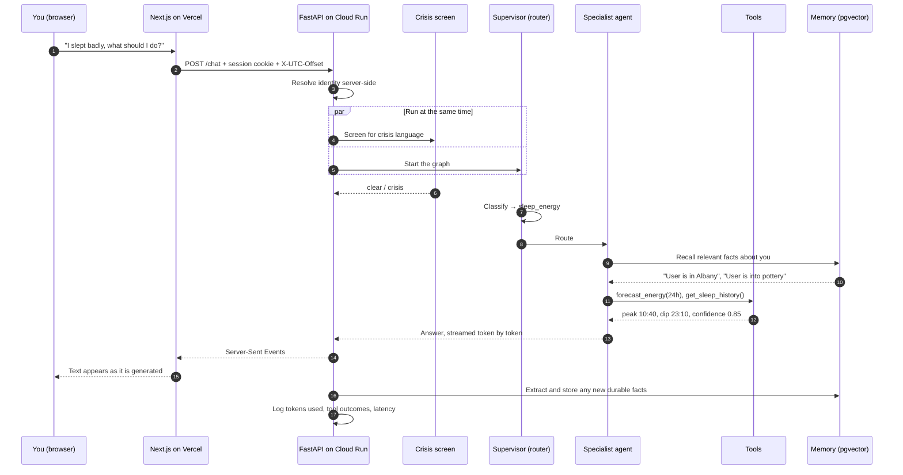
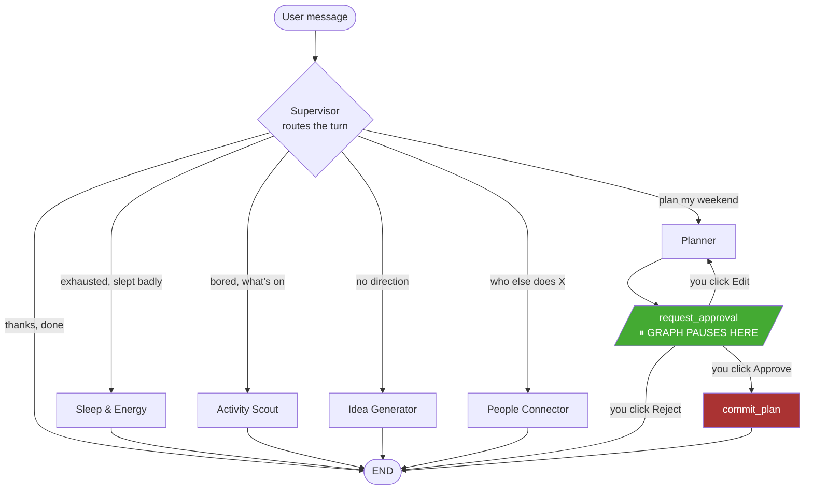
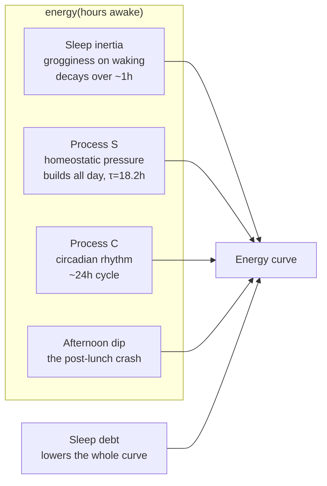
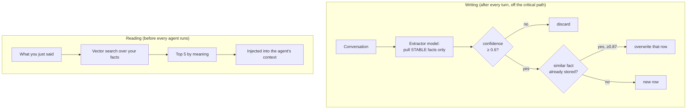
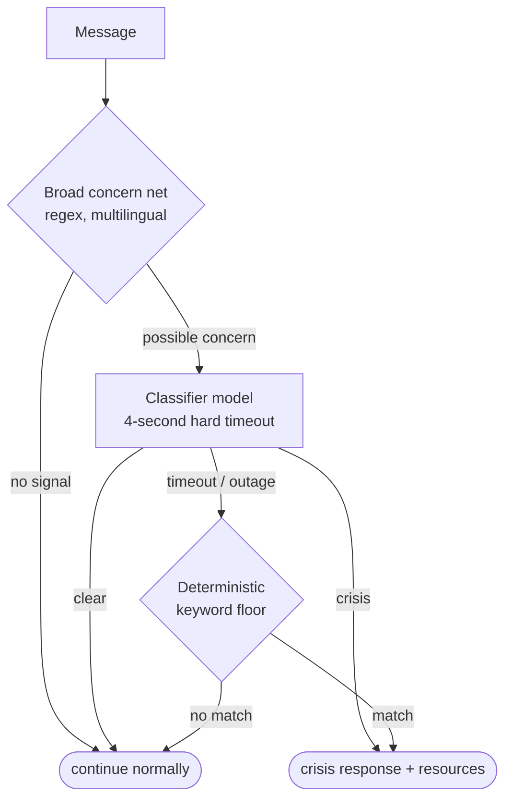
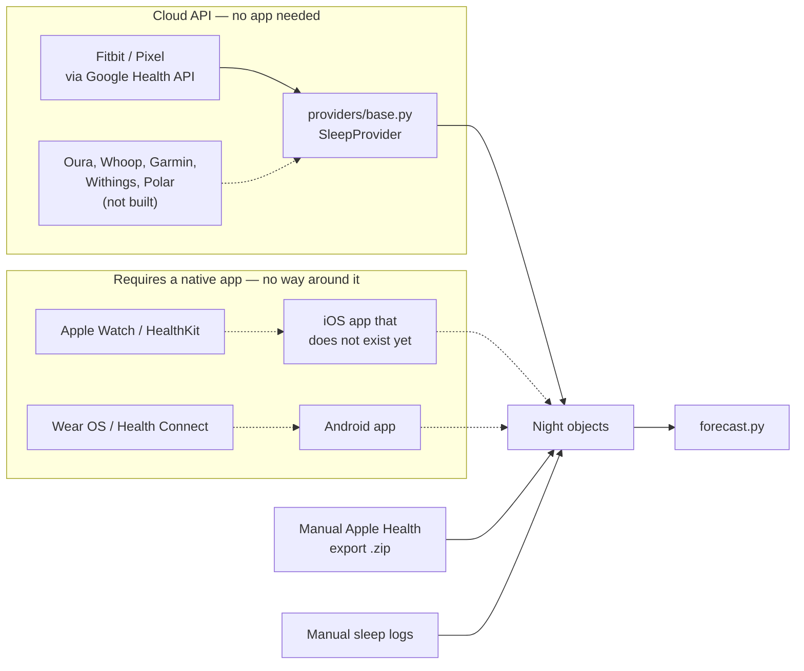

# VITAL — the whole thing, explained

A complete walkthrough of what VITAL is, how it works, what we chose and
why, what broke, and what we learned. Written so you can explain it to an
engineer, a recruiter, or your mum, depending on which section you read.

---

## 1. What VITAL is, in one paragraph

VITAL is an **energy copilot**. You talk to it in plain language — "I slept
badly, what should I do today?" — and it routes you to the right specialist,
remembers durable facts about you, predicts when you'll actually have energy,
and turns all of that into a concrete schedule that you approve before
anything is committed. It reads your Fitbit sleep data, forecasts your energy
curve for the next 24–72 hours, and plans your day around your predicted
peaks and dips instead of generic advice.

**The one-sentence pitch:** most wellness apps tell you what happened; VITAL
tells you what's *going to* happen and schedules around it.

---

## 2. The 60-second version

> VITAL is a multi-agent AI assistant for managing your energy. A router
> model reads your message and sends it to one of four specialists — sleep,
> activities, ideas, or people. Each specialist has real tools: weather,
> maps, ticketing, a sandboxed Python environment for analysing your health
> data. A separate planner turns the conversation into a schedule, which
> pauses and waits for your approval before it can write anything.
>
> Underneath, three things make it personal: **semantic memory** (it
> remembers "you're into pottery" and retrieves it when you ask about
> ceramics), an **energy forecast** built from a real sleep-science model
> keyed to your own wake time, and **wearable sync** that pulls your actual
> sleep from Fitbit.
>
> It's a Python/FastAPI backend on Google Cloud Run, a Next.js frontend on
> Vercel, LangGraph for the agent orchestration, Gemini for the models, and
> Postgres with pgvector for memory. About 6,000 lines of backend, 3,000 of
> frontend, and 5,800 lines of tests.

---

## 3. End to end: the life of one message

This is the flow to walk someone through. Everything else in this document
is detail hanging off this spine.



**The parts worth pointing out when you explain this:**

- Step 4–5: the crisis screen runs **in parallel** with the graph, not
  before it. Stacking them added ~1.5s to every message. Overlapping them
  made it free.
- Step 3: identity is resolved **server-side, always**. The browser can
  never say who it is.
- Step 12: the forecast is computed from *your* wake time, not a rule in a
  prompt.
- Step 15: memory extraction happens **after** the answer is sent, so it
  never makes you wait.

---

## 4. The map: what lives where

```
VITAL/
├── vital-app/                  BACKEND — Python, FastAPI, LangGraph
│   ├── src/vital/
│   │   ├── api.py              (1099) Every HTTP route. The front door.
│   │   ├── graph.py             (191) Wires the agent graph together
│   │   ├── supervisor.py        (109) The router: which agent handles this?
│   │   ├── planner.py           (171) Builds schedules + the approval gate
│   │   ├── agents/
│   │   │   ├── sleep_energy.py  (145) Sleep, tiredness, energy, forecasting
│   │   │   ├── activity_scout.py (50) Things to do
│   │   │   ├── idea_generator.py (58) Projects, hobbies, direction
│   │   │   └── people_connector.py(103) Finding people and groups
│   │   ├── tools/
│   │   │   ├── weather.py        (62) OpenWeather
│   │   │   ├── places.py         (64) Google Places
│   │   │   └── events.py         (48) Ticketmaster
│   │   ├── forecast.py          (458) THE ENERGY MODEL. Pure maths, no I/O.
│   │   ├── memory.py            (243) Semantic memory: store, dedupe, recall
│   │   ├── guardrails.py        (325) Crisis detection + token budgets
│   │   ├── security.py          (216) Identity, sessions, Firebase auth
│   │   ├── storage.py           (667) All database access. 16 tables.
│   │   ├── sandbox.py           (100) Safe execution of model-written code
│   │   ├── analysis.py          (142) Pandas analysis of uploaded health data
│   │   ├── ingest.py            (155) Apple Health export parsing
│   │   ├── buddies.py           (352) The Activity Buddy Board
│   │   ├── sync.py              (193) Wearable sync, provider-agnostic
│   │   ├── providers/
│   │   │   ├── base.py           (76) The SleepProvider contract
│   │   │   └── google_health.py (306) Fitbit / Pixel Watch adapter
│   │   ├── secrets.py           (100) Encryption for stored OAuth tokens
│   │   ├── oauth_state.py       (111) CSRF protection for the OAuth flow
│   │   ├── metrics.py           (104) Structured logging for alerting
│   │   └── config.py            (163) Every configurable knob, one place
│   ├── tests/                  31 files, 5,792 lines, 400+ tests
│   └── scripts/                Threshold tuning, memory backfill
│
├── vital-web/                  FRONTEND — Next.js 15, React 19
│   └── app/
│       ├── page.jsx            (653) The whole app's state and orchestration
│       ├── components/
│       │   ├── Chat.jsx        (329) Message list, streaming, plan cards
│       │   ├── Sidebar.jsx      (92) Threads, forecast, devices, memory
│       │   ├── SidePanel.jsx   (191) Sleep, plan, buddies, location
│       │   ├── Buddies.jsx     (381) The buddy board UI
│       │   ├── EnergyCurve.jsx  (93) The forecast chart (hand-rolled SVG)
│       │   ├── DeviceConnection.jsx (147) Connect / sync / disconnect
│       │   └── AuthGate.jsx     (84) Sign-in wall
│       └── lib/
│           ├── api.js          (150) Every HTTP call. Headers live ONLY here.
│           ├── stream.js        (64) Server-Sent Events parsing
│           ├── auth.js         (141) Firebase Google Sign-In
│           ├── guard.js         (59) Stops stale responses landing in new threads
│           └── theme.js        (178) Time-of-day theming
│
├── vital-mobile/               Expo shell. Not yet a real client.
└── docs/                       LIMITATIONS.md, OBSERVABILITY.md
```

**The rule that keeps this navigable:** every file has one job, and the file
header says what it is and *why it exists*. Most headers describe a bug that
justified the file.

---

## 5. The technology stack, and why each piece

| Layer | Choice | Why this one |
|---|---|---|
| Agent orchestration | **LangGraph** | Graphs with durable state. The pause-for-approval flow needs a graph that can stop mid-run, persist, and resume days later. A plain chain can't do that. |
| Models | **Gemini 2.5 Flash** (Vertex AI) | Routing is classification — a cheap fast model does it well. Quality lives in the prompt, not the model tier. Upgrading the model to fix routing would have hidden a prompt bug. |
| Embeddings | **text-embedding-004** | For semantic memory. Turns "pottery" and "ceramics" into nearby vectors. |
| API | **FastAPI** | Async, typed, automatic OpenAPI docs, native Server-Sent Events for streaming. |
| Streaming | **SSE** (not WebSockets) | One-way server→client is all we need. SSE survives proxies, reconnects natively, and needs no extra infrastructure. |
| Database | **Postgres + pgvector** on Cloud SQL | One store for everything: app tables, agent checkpoints, and memory vectors. Fewer moving parts than a separate vector DB. |
| Frontend | **Next.js 15 / React 19** on Vercel | Static export, instant deploys from git, free tier. |
| Auth | **Firebase Google Sign-In** | Identity without building password infrastructure. |
| Backend hosting | **Cloud Run** | Scales to zero, no servers, same project as Vertex and Cloud SQL. |
| Secrets | **Secret Manager** | Nothing sensitive in env files or the frontend bundle. |
| Sandboxing | **E2B Firecracker microVMs** | Runs model-written Python without letting it near our infrastructure. |
| Wearables | **Google Health API** | Fitbit's own API is decommissioned Sept 2026. |
| Observability | **Structured JSON logs → log-based metrics → alert policies** | No extra vendor. Cloud Logging already sees everything. |

---

## 6. Architecture: the graph



**The security insight worth explaining:** `commit_plan` — the only node
that writes to your calendar — has **no inbound edge except the human
approval resume**. It is not "the model decides not to write"; it is
*topologically unreachable* without a human click. No prompt injection can
route to it, because there is no route.

That's the difference between a guardrail and a wall. This is a wall.

---

## 7. The energy forecast — the actual differentiator

Everything else in VITAL looks backward. This is the only part that predicts.

### The problem it solves

The Sleep & Energy prompt used to contain this instruction:

> "today's likely energy peak (~3-5h after wake) and dip (~7-9h after wake)"

That's a fact stated to a language model. It can't be tested, it's identical
for everyone, and the planner can't use it. So we made it code.

### The model

Based on **Borbély's two-process model**, the standard framework in sleep
science. Four named components:



The resulting curve, for a 7am wake:

| Time since waking | Energy | What's happening |
|---|---|---|
| 0h | 0.57 | Groggy — sleep inertia |
| **3.5h** | **0.86** | **Peak.** Inertia gone, pressure still low |
| 8.5h | 0.64 | **Dip.** Circadian trough plus accumulated pressure |
| 11h | 0.68 | Partial second wind |
| 16h+ | 0.55 ↓ | Steady decline |

The constants weren't guessed. They were **solved numerically** against the
target shape, and the tests re-derive the peak, dip, rebound and decline
*from* the constants — so if someone tunes a number and the shape breaks,
the build fails.

### Why confidence matters as much as the curve

A forecast can't be checked against reality on the day it's made. That makes
**confident nonsense** the natural failure mode. So confidence is computed
from data sufficiency and capped at 0.85 — it never claims certainty:

| Your data | Confidence | What it says |
|---|---|---|
| Nothing | 0.10 | "population averages — no sleep data yet" |
| Apple Health export only | ~0.21 | duration but no wake times → timing is generic |
| 14 logged nights | ~0.85 | genuinely yours |

That's why the panel currently shows **10%** — and says so in plain words
rather than drawing an authoritative-looking line.

### How it reaches the rest of the app

- **As a tool** on the Sleep & Energy agent: `forecast_energy(horizon_hours)`
- **Injected into the Planner's prompt**, because the planner is a
  structured-output call and giving one model both a tool loop and a strict
  schema reliably yields neither
- **As a chart** in the sidebar
- The planner rule: *"put the most demanding item nearest a predicted peak,
  and say so in the rationale, with the actual predicted time"*

That's what turns "here's a reasonable schedule" into "climbing at 2pm
because that's your predicted peak, and I moved dinner because you'll be in
a dip."

---

## 8. Memory — how it knows you



**Only stable facts.** "Lives in Albany" yes; "is tired today" no. The
extractor prompt enforces it, a confidence floor catches the rest, and the
most common correct answer is an empty list.

**The dedupe is the interesting part.** The old version compared *words*
using `difflib`, which read these as four different facts:

```
User is in Albany.
User is located in or near Albany.
User is located in Albany/Guilderland.
User is interested in Albany.
```

Now it compares *meaning*. And critically, `duplicate_key` uses the database
only to **rank candidates** and then re-scores them itself — because the two
storage backends embed search queries differently, and trusting either one
made the threshold mean two different things. (Section 12 tells that story
properly; it's the best lesson in the project.)

**It's inspectable and editable.** Everything VITAL knows is listed in the
sidebar with a delete button. Nothing is hidden.

---

## 9. Safety — four independent mechanisms

### 9.1 Crisis detection: a cascade, not a keyword list



Keywords alone caught **13.3%** of the labelled crisis set. The cascade
catches **100%**. The keyword layer survives as the **outage floor** — if
the model is down or slow, the deterministic matcher still runs, because a
distressed person must never sit on a spinner.

The 4-second timeout is enforced with a module-level thread pool and
abandoned futures. An earlier version used `with ThreadPoolExecutor(...)`,
whose `__exit__` calls `shutdown(wait=True)` — which made the timeout
completely useless. The test failed at 30 seconds and told us.

### 9.2 Human-in-the-loop as topology

Covered in section 6. Worth repeating because it's the strongest idea in the
codebase: **security by graph shape, not by instruction.**

### 9.3 Sandboxed code execution

When you ask "what's my sleep debt over the last month", a model writes
pandas code and runs it. Two independent layers:

1. **AST-based static gate** *before* execution. Prompt injection can make
   the model write hostile code; it cannot make a Python parser approve it.
2. **E2B Firecracker microVM.** No secrets, no filesystem access, destroyed
   after each run.

Honest limitation, documented in the code: the microVM may still have
outbound internet on the free tier, so exfiltration control is the static
gate's URL ban, not the VM.

### 9.4 Identity is never claimed by the client

Three caller kinds, and rules that never soften:

- A present-but-invalid token is a hard **401** — never a silent downgrade
  to anonymous
- Verification failures return **one generic message**, so an attacker
  can't fingerprint expired vs wrong-project vs bad-signature
- Once an anonymous session is linked to an account, the bare session stops
  resolving to it — signing out really signs you out, server-side
- On the buddy board, anonymous IDs embed the session secret, so public
  payloads carry an **opaque hash** instead — enough to block or report
  someone, useless for hijacking their session

---

## 10. Data and integrations: the dependency taxonomy

This is the most transferable idea in the project.

### What happened

The People Connector called Reddit's community search. Reddit blocks
datacenter IPs, so **every call from Cloud Run failed**. The tool degraded
gracefully — returning an `error` key, which the agent faithfully reported
as "community search is temporarily down" — so a completely dead feature
looked like a transient blip **for months**.

We fixed the auth properly. Then discovered Reddit had closed self-service
API registration entirely.

### Then we looked at the whole category

| Provider | Status |
|---|---|
| Eventbrite public search | endpoint removed, 2019 |
| Facebook Groups | deprecated for third parties, 2020 |
| Meetup | open API retired, paid tier only, 2023 |
| Reddit | approval-only, 2026 |
| Strava clubs | endpoints removed, subscription required, 2026 |
| Fitbit Web API | decommissioned Sept 2026 |
| Discord | never had a public directory API |

Seven for seven. That's not bad luck.

### The rule this implies

Sort every external dependency into two classes:

- **Commoditised infrastructure** — geo, maps, weather, ticketing. Multiple
  vendors, stable pricing, no strategic reason to close. **Build on these.**
- **Platform-gated social data** — who belongs to what, who talks to whom.
  Single-source, strategically valuable, reliably closes. **Own these or do
  without.**

VITAL's durable tools (Places, OpenWeather, Ticketmaster) are all class one.
The one that died was class two. And the **Activity Buddy Board** is class
two that we own outright — which is why it's the only real answer.

### Applied to wearables



**Apple Watch cannot be synced from a server. At all.** HealthKit data lives
on the device; Apple runs no aggregation service. Every route requires a
native iOS app — aggregators like Terra and Validic don't avoid this, they
just hand you an iOS SDK to embed in your own app.

**Oura and Whoop aren't built on purpose.** We don't own those devices, so an
adapter would pass tests against mocked responses and be completely
unverified against the real API. That's the Reddit failure recreated
deliberately. The *seam* is built instead — each new provider is one file.

---

## 11. Observability — making silence loud

The Reddit incident's real lesson wasn't about Reddit. It was that
**graceful degradation without a failure rate hides outages indefinitely.**

So every tool call now emits a structured log line:

```json
{"metric": "tool_call", "tool": "search_places", "outcome": "error",
 "error": "HTTPStatusError", "duration_ms": 1234, "user": "<hashed>"}
```

Those feed a log-based metric, grouped by tool, with an alert policy on the
failure rate. Grouping by tool matters: one dead tool among six healthy ones
barely moves an aggregate rate, but stands out immediately when split.

There is one central observation point — the graph's event stream — so a new
tool can't be forgotten. A test enforces that every tool signals failure the
same way (a dict with an `error` key), because a tool that fails differently
is invisible to the alerting.

User IDs are hashed. Anonymous session IDs are identity too.

---

## 12. What failure taught us

This is the section worth reading twice. Five separate bugs, one shape.

### The recurring pattern: the test and production measuring different things

**Incident 1 — the crisis eval scored its own fallback.** The live evaluation
reported 88.9% accuracy, *identical* to the keyword baseline. Because every
model call was 403ing on a fake project, and the code silently fell back to
keywords. The eval was measuring the thing it was supposed to be testing
against. Fix: score the classifier directly, add a canary, and assert the
result is *not* byte-identical to the fallback.

**Incident 2 — the crisis classifier had never worked.** It sent a lone
`SystemMessage`. Gemini requires a user turn. It had never once run in
production.

**Incident 3 — a passing test for an unwired tool.** The test checked the
module's imports rather than what `create_react_agent` actually received. It
would have passed with the tool removed. Caught by mutation testing.

**Incident 4 — three wrong memory thresholds in a row.** 0.82, then 0.87,
then 0.63. The cause took hours to find: `text-embedding-004` is
*task-typed*, and the tuning script compared two documents while the running
code compared a query to a document. The same pair of sentences scores ~0.24
apart between the two. So the threshold was calibrated on one scale and
enforced on another.

**Incident 5 — and then the same thing again, inverted.** After fixing that,
production collapsed every distinct fact into a single row. Why? The two
storage backends embed search queries **differently**:

| | stored fact | search query | dedupe compares |
|---|---|---|---|
| InMemoryStore — every test, every eval | `embed_documents` | `embed_query` | doc↔query |
| PostgresStore — production | `embed_documents` | `embed_documents` | **doc↔doc** |

Every test ran on one backend; production ran on the other. **No test could
have caught it, because the tests were the thing being agreed with.**

### The structural fix

Stop delegating the decision. `duplicate_key` now uses the store only to
*rank* candidates and re-scores them itself through one shared function.
The four separate implementations of "cosine between two facts" — in the
app, the tuner, the backfill script, and the regression guard — were
collapsed into one.

> **The lesson:** a regression guard that re-derives the thing it guards
> only pins your own assumption. If a test and the code both compute
> something, they will eventually compute it differently.

### Two more, from the last hour

**The frontend crash.** A sidebar prop referenced `loadPanel`; the function
is called `refreshPanel`. An undefined identifier in JSX is a ReferenceError
at render, so React tore down the entire tree — chat included, for a sidebar
feature. `npm run build` catches this in two seconds. It wasn't run.

**The CORS outage.** A new `X-UTC-Offset` header was added to every frontend
request without adding it to the server's `allow_headers` allowlist. The
browser then failed the **preflight** on every call. The app reported "can't
reach the backend" while the server was healthy, answering `curl` normally,
and logging nothing wrong. The only evidence was in the network tab.

Both are the same shape as the other five: **verifying one side of a
boundary.** The fix wasn't the one-line change, it was
`test_cors_contract.py`, which reads the frontend's client and asserts every
header it sends is allowed — a test that *crosses* the boundary.

### Other things that broke, briefly

| What | Why | Lesson |
|---|---|---|
| HTTP/2 flag caused a total outage | uvicorn doesn't speak h2c | Don't take deployment advice without checking the server supports it |
| `git reset --hard` discarded 4 commits | Assumed origin had everything | Recoverable via reflog; own it immediately |
| 150× token undercounting | `chars/4` estimate vs real provider counts | Estimates drift; bill from the source |
| 5× routing waste, 37–57s turns | Router couldn't tell an agent had already answered | State it plainly in the prompt; don't raise the loop limit |
| Upload OOM on Apple Health exports | Whole file read into memory | Stream to a temp file, cap the size |
| Blocking DB calls froze the event loop | `async def` handlers calling sync `sqlite3` | Sync work goes in a threadpool or a `def` handler |

---

## 13. How this codebase is tested

**400+ tests, 5,792 lines — roughly one line of test per line of source.**

Four principles, each learned from a failure above:

1. **Offline by default.** Tests are zero-network. Every external dependency
   has exactly one seam, patched in `conftest.py`.
2. **Live evals, explicitly gated.** Real semantic quality can't be judged by
   a fake embedder. `MEMORY_LIVE_EVAL=1` and `CRISIS_LIVE_EVAL=1` run against
   the real models — and they **refuse to run** against a fake project rather
   than silently measuring the stand-in.
3. **Test the property, not the instance.** After each bug, the test that
   gets written is the one that catches the *class*. The CORS test doesn't
   check for `X-UTC-Offset`; it checks every header the frontend sends.
4. **Guard the guards.** `test_the_scan_actually_finds_something` exists
   because a regex-based test that stops matching would pass vacuously and
   the protection would vanish with nothing to notice.

Tests read like documentation on purpose:

```
test_a_confident_backend_cannot_force_a_merge
test_the_morning_peak_is_the_high_point_of_the_whole_day
test_a_state_from_another_session_is_rejected
test_naps_are_not_nights
test_an_expired_refresh_token_is_an_auth_error
```

---

## 14. What's genuinely unique here

Ordered by how hard they'd be to copy.

1. **Security as topology.** `commit_plan` is unreachable without a human
   click — not because a prompt says so, but because no edge exists. Most
   "human in the loop" implementations are an instruction the model can be
   argued out of.

2. **A real forecast, not a prompt claim.** A named sleep-science model with
   constants solved numerically and pinned by tests, keyed to *your* wake
   time, feeding both the chat and the planner.

3. **Confidence that degrades honestly.** The forecast says 10% and "this is
   a typical curve rather than yours" instead of drawing an authoritative
   line. Very few products give you the number that says "don't trust me
   much yet".

4. **A dependency taxonomy derived from evidence.** Seven dead APIs in six
   years produced a rule about which classes of dependency to build on. It's
   written down in `LIMITATIONS.md` so it doesn't get re-litigated.

5. **The provider seam.** Adding Oura is one file. The forecast, storage, UI
   and sync layer don't change.

6. **Failure archaeology in the code.** Most comments explain *why the file
   exists*, usually by naming the bug that justified it. Someone new can read
   the reasoning, not just the result.

7. **Owning a class-two dependency.** The Activity Buddy Board is the only
   source of actual people, and nobody else has it. Its cold-start problem is
   a product problem, not one another API would solve.

---

## 15. Tradeoffs we made, stated plainly

| Decision | What we gained | What it cost |
|---|---|---|
| Flash model everywhere, not Pro | ~10× cheaper, much faster | Quality must live in prompts. When routing failed we fixed the prompt, not the model — which surfaced a real bug an upgrade would have masked. |
| Postgres + pgvector, not a vector DB | One store, one connection pool, one backup | Slower than a dedicated vector DB at scale we don't have |
| Deterministic forecast, no ML | Explainable, testable, works from night one | Population constants until enough data exists to fit per-user |
| SSE, not WebSockets | Simple, proxy-friendly, native reconnect | One-way only |
| Trim history to 20 messages | Bounded cost and latency | Long threads lose early context; no summarisation yet |
| Delete-and-relearn instead of backfilling memory | Saved arranging prod DB access for nine rows | Would be unacceptable with real users |
| Only build providers we can test | No unverifiable integrations | Oura users can't connect yet |
| Testing-mode OAuth | Working today, no cost | Refresh tokens expire every 7 days |
| Server-resolved identity only | Client can never claim a user | Slightly more plumbing on every route |
| Memory is semantic | "ceramics" finds "pottery" | An embedding call on every write and recall |

---

## 16. Current status

```
Backend         5,883 lines    Frontend      2,993 lines
Tests           5,792 lines    Test files            31
Tests passing         400+     Commits               70
HTTP routes             30     Database tables       16
Agents                   4     Tools                  8
```

**Live:** https://vital-agent.vercel.app

**Working:** chat with 4 specialist agents, semantic memory, crisis
detection, human-approved planning, energy forecast, Fitbit sync, buddy
board, Apple Health upload, sleep analysis in a sandbox, tool-health
alerting.

**Known limits** (all in `docs/LIMITATIONS.md`):

- Apple Watch needs a native iOS app; no server can reach HealthKit
- OAuth refresh tokens expire every 7 days until the app is verified
  (verification = OAuth review + annual CASA assessment, $500–$4,500)
- Plans commit to VITAL's own calendar, not Google Calendar
- Long threads lose early context rather than compressing it
- No proactive loop — VITAL only exists when the tab is open

**Next, in priority order:** Google Calendar write (the approval topology
already makes this safe), a proactive daily brief, per-user forecast
coefficients once there's calibration data, and an iOS app if Apple Watch
matters.

---

## 17. If someone asks you...

**"What's actually hard about this?"**
Not the chat. The hard parts are: making a forecast that's honest about its
own uncertainty, making human approval structurally impossible to bypass,
and keeping the tests measuring the same thing production does — which we
got wrong five times before we understood the pattern.

**"Why multiple agents instead of one big prompt?"**
Each specialist has different tools and a different job. One prompt with
eight tools picks the wrong one and can't be evaluated per-domain. The
supervisor is a *classifier*, which is a well-defined task a cheap model
does reliably.

**"How do you stop it doing something you didn't ask for?"**
The only node that writes to your calendar has no inbound edge except your
click. It's not a rule the model follows — it's a path that doesn't exist.

**"What happens when an external API dies?"**
We've learned that answer the hard way. Every tool reports failure the same
way, every failure is counted, and the failure *rate* is alerted on — because
a tool that fails politely is indistinguishable from one that's working
until you measure it.

**"Is the forecast accurate?"**
Right now it says 10% confident and tells you it's a population average,
which is the honest answer with no wearable connected. Connect Fitbit and it
becomes yours. Whether it's *right* is unfalsifiable day to day, which is
exactly why confidence is displayed as prominently as the curve.

**"What would you do differently?"**
Run the frontend build before pushing. Write the boundary-crossing test
first instead of after the fifth incident. And treat "the test passes" as a
claim to verify rather than a fact.
